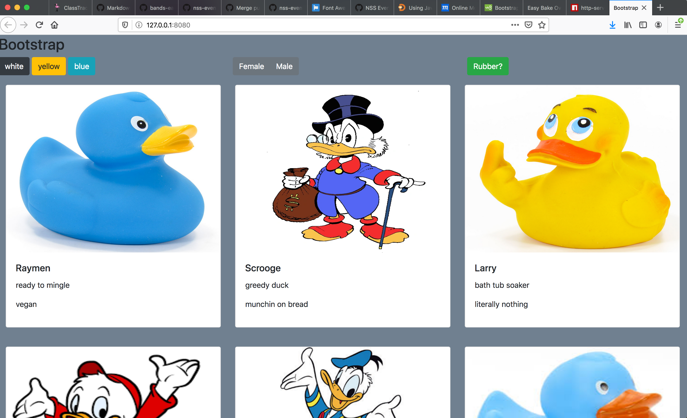

# BOOTSTRAP

## Description
This project we dove into bootstrap to better understand its gridsystem. We used bootstrap cards to display a collection of ducks (both real and rubber). We also give our users the ability to filter the ducks by color, gender, and if the ducks are rubber
## Screenshots

## How to run
1. Clone down this rep
1. Make sure you have http-server installed via npm. if not get it [HERE](https://www.npmjs.com/package/http-server).
1. On your command line run `hs` -p `9999`
1. In your browser go to `http://localhost:9999`